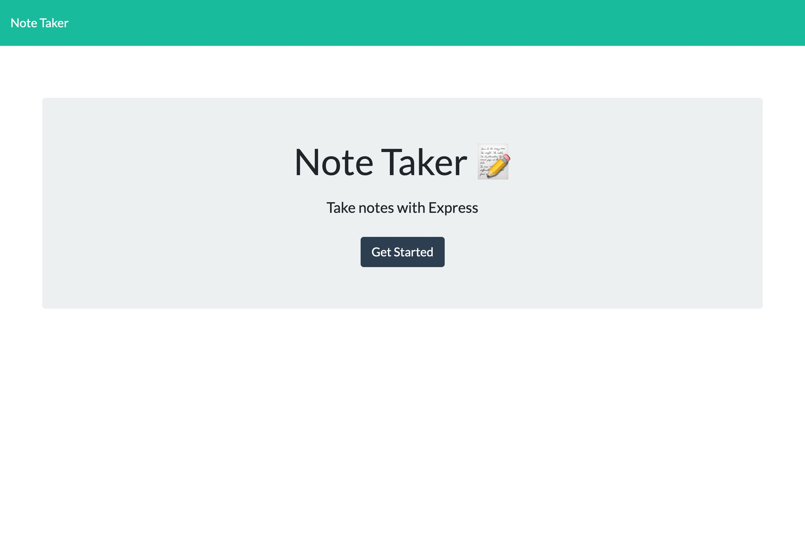
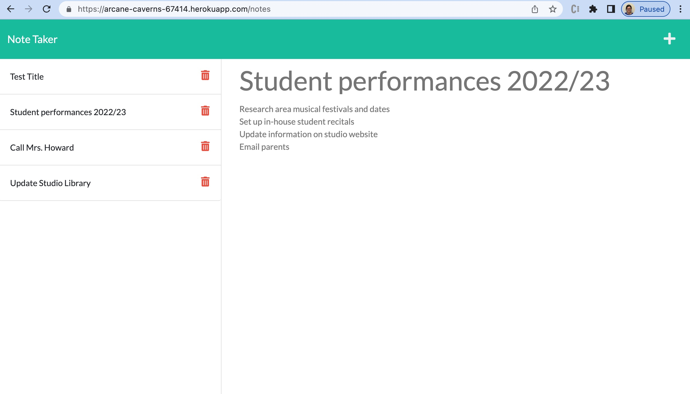

# Note Taker

  ###  

  ## Table of Contents
  - [Description](#description)
  - [Installation](#installation)
  - [Usage](#usage)
  - [Contributing](#contributing)
  - [Tests](#tests)
  - [Questions](#questions)
  - [License](#license)

  ## Description 
  Note Taker is geared towards small business owners who need a no-frills tool to organize ideas and track tasks.
  
  ## Installation 
   1. Node.js (npm init) 2. npm i express@4.16.4 3. npm i uuid@9.0.0
  
  ## Usage
  Option 1: Invoke the application from the CLI: node server Option 2: Access the deployed application on Heroku: https://arcane-caverns-67414.herokuapp.com

  ## Contributing 
  Developers who have ideas for improvement may fork this project and submit pull requests for review.

  ## Tests
  n/a

  ## Questions 
  Please feel free to reach out via either of the links below if you have additional questions about this application. 
  GitHub: <a href="https://github.com/raposamillar/">raposamillar</a> 
  Email: lisa.raposamillar@gmail.com

  ## License
  ### This application is covered under the [GPL v3.0](https://choosealicense.com/licenses/gpl-3.0/) license.
  
   
  
